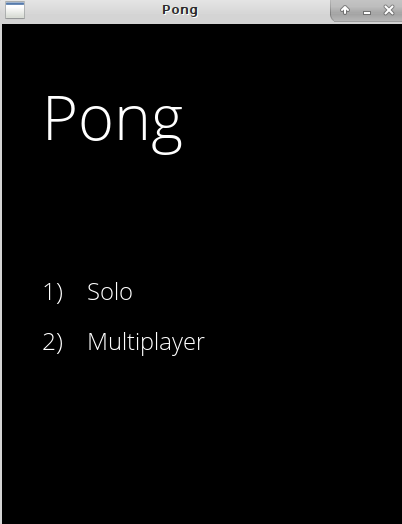
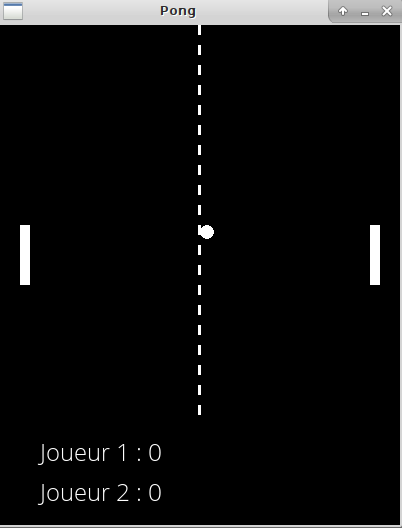
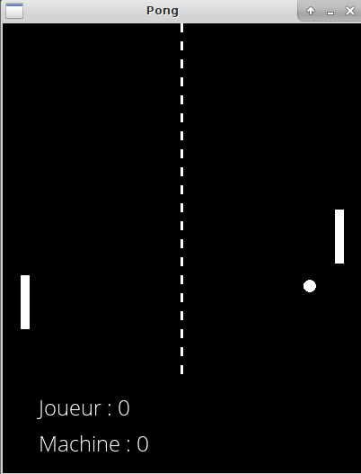
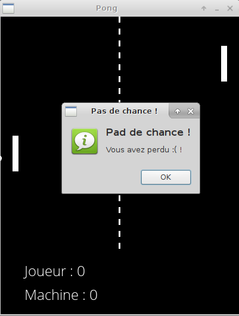

## Pong with Allegro

### Presenteation

Le jeu de Pong implémenté en C avec la bibliothéque Allegro5.
Propose un mode Solo et un mode multijoueur.

### technologies utilisés

Le jeu a été codé en C, grace à la bibliothéque [ALlegro5](http://liballeg.org/).

### Demonstration

